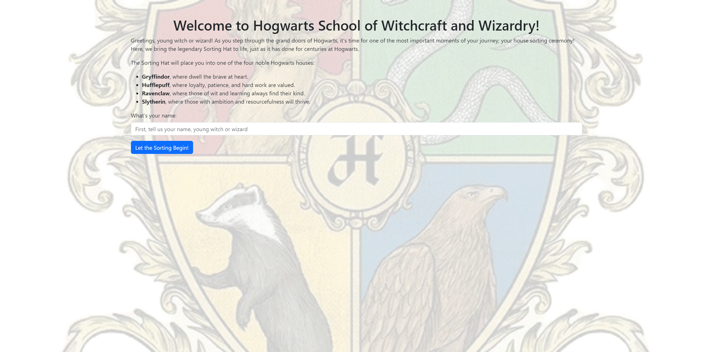
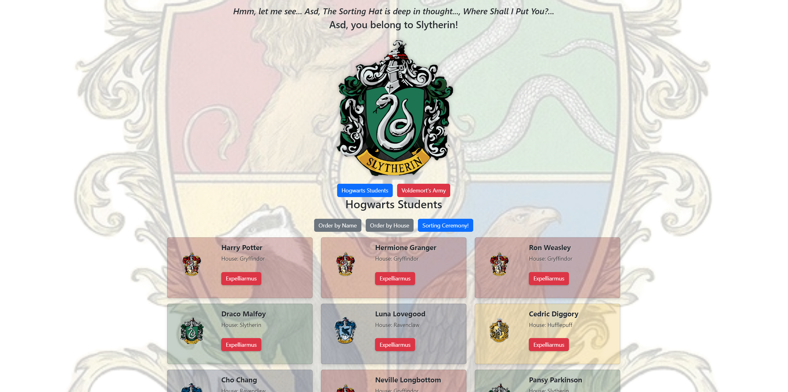
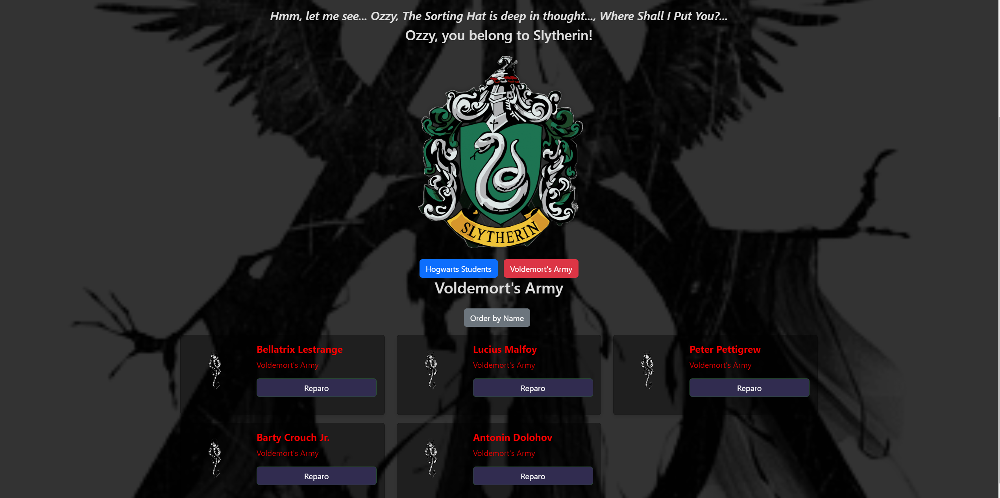

# Sorting Hat

## Screenshots

*Figure 1: The Sorting Hat introduces itself and starts the sorting process.*

*Figure 2: Display of sorted students with their assigned houses.*

*Figure 3: Expelled students in Voldemort's Army.*

## Overview
This project brings the Hogwarts sorting hat to life! It's an interactive web application built using HTML, CSS, JavaScript, and Bootstrap. Users can input their name and be sorted into one of the four Hogwarts houses (Gryffindor, Hufflepuff, Ravenclaw,Slytherin) either randomly or through a quiz. The application also features student management, including the ability to expel(Expelliarmus) students to Voldemort's Army and recruit(Reparo) them back.

## Project Links
- [Project Board](https://github.com/omerakben/INDIVIDUAL-PROJECT-sorting-hat.git)
- [Deployed Project](https://sage-cuchufli-a4779a.netlify.app/)

## Demo Video
[Demo GUI](https://www.loom.com/share/680f6d8b998f4583bf80a65cbe0bc59f?sid=11aed5c4-b07f-468f-a435-96ca017ef491)

## User Story
As a Hogwarts administrator, I need a digital sorting hat to efficiently assign new students to houses and manage the student roster. This application provides a quick and fair way to distribute students among the four houses while allowing for easy management of the student list, including the ability to expel students when necessary.

## Features
- Interactive sorting hat introduction
- Student name input with validation (letters only)
- Random house assignment or sorting quiz option
- Display of sorted students in cards with house crests
- Ability to expel students to Voldemort's Army
- Ability to recruit students back from Voldemort's Army
- Filter students by house
- Sort students alphabetically or by house
- Responsive design for various screen sizes
- Theme toggle between Hogwarts and Voldemort's Army views

## Technical Details
- Modular JS structure
- Management for student data
- Dynamic DOM manipulation
- Event delegation for efficient event handling
- CSS variables for easy theming
- Responsive design using Bootstrap and custom CSS

## Key Learnings
- Advanced JavaScript methods and DOM manipulation
- JS - ES6 modules
- State management in vanilla JS
- Responsive design with Bootstrap 5 and custom CSS
- Event handling and dynamic content generation

## Challenges and Solutions
1. Background Image Handling:
   - Challenge: Adding a grayscale background image without affecting other elements.
   - Solution: Used `body::before` pseudo-element to create an overlay, allowing for a fixed background that doesn't interfere with scrolling.

2. Quiz Logic:
   - Challenge: Implementing sorting system when quiz answers are evenly distributed.
   - Solution: Created a scoring system that allows for random selection among tied houses, ensuring fairness in sorting.

3. Sorting with Different Themes:
   - Challenge: Implementing distinct visual themes for Hogwarts and Voldemort's Army.
   - Solution: Created separate CSS classes for each theme and toggled them dynamically using JavaScript. Used different background images and color schemes to differentiate between Hogwarts and Voldemort's Army views.

4. Displaying based on House or Army:
   - Challenge: Efficiently organizing and displaying students based on their house or allegiance to Voldemort.
   - Solution: Implemented separate display functions for Hogwarts students and Voldemort's Army. Used conditional rendering to show appropriate logos, colors, and buttons based on the student's affiliation.

5. Updating Displays:
   - Challenge: Keeping the display up-to-date after expelling or recruiting students.
   - Solution: Created an `updateDisplay` function that refreshes both Hogwarts and Voldemort's Army containers whenever a student's status changes. This ensures that the UI always reflects the current state of student affiliations.

6. Reset Sorting:
   - Challenge: Allowing users to start a new sorting process without refreshing the page.
   - Solution: Implemented a `resetSorting` function that clears input fields, resets state variables, and returns the user to the initial sorting screen. This function also handles resetting elements and scroll position for a seamless experience.

7. Show Page Logic:
   - Challenge: Managing the visibility of different sections (sorting hat, Hogwarts students, Voldemort's Army) based on user interactions.
   - Solution: Developed a `showPage` function that handles the display logic for different pages. This function toggles visibility of relevant elements, updates the current page state, and triggers appropriate display functions based on the selected page.

8. Maintaining State:
   - Challenge: Keeping track of students' data consistency across different views.
   - Solution: Utilized a central `state` object to store and manage student data, including separate arrays for Hogwarts students and Voldemort's Army. This approach allowed for easy updates and consistent data representation throughout the application.

9. Dynamic Card Creation:
   - Challenge: Creating visually appealing and interactive student cards that reflect their house or allegiance.
   - Solution: Implemented a flexible `createStudentCard` function that generates HTML for student cards, incorporating house-specific colors, logos, and interactive buttons. This function adapts its output based on whether the student belongs to Hogwarts or Voldemort's Army.

10. Sorting and Filtering:
    - Challenge: Allowing users to sort and organize students within their respective groups.
    - Solution: Added sorting functionality for both Hogwarts students (by name and house) and Voldemort's Army (by name). Implemented event listeners on sorting buttons to trigger the appropriate sorting functions and update the display accordingly.

## Future Improvements
- Implement local storage data between sessions
- Add animations for sorting and expelling students
- Create a more detailed student profile system
- Implement a house points system

## Resources
- [Bootstrap Documentation](https://getbootstrap.com/docs/5.0/getting-started/introduction/)
- [JavaScript Array Methods](https://developer.mozilla.org/en-US/docs/Web/JavaScript/Reference/Global_Objects/Array)
- [CSS Variables](https://developer.mozilla.org/en-US/docs/Web/CSS/Using_CSS_custom_properties)

## Contributors
- [Omer Ozzy Akben](https://github.com/omerakben)

## Contact
- [LinkedIn](https://www.linkedin.com/in/omerakben/)
